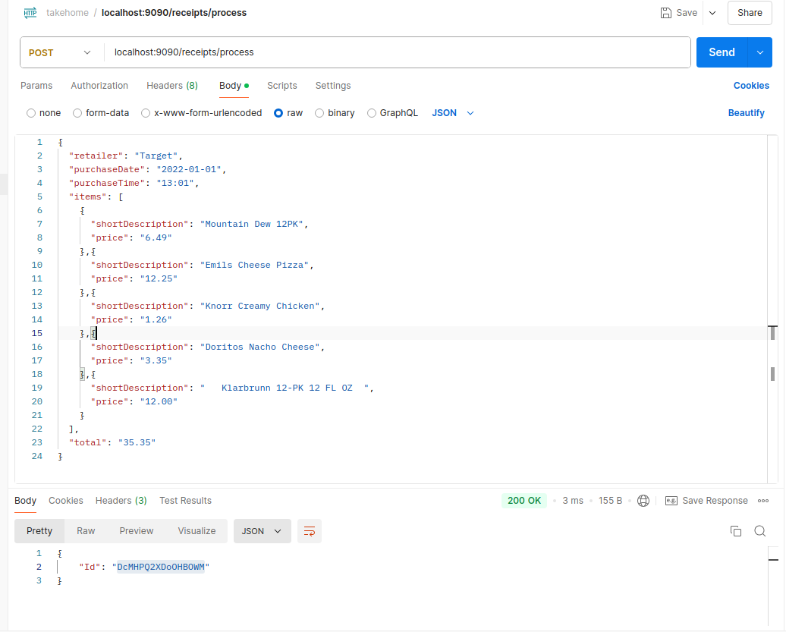
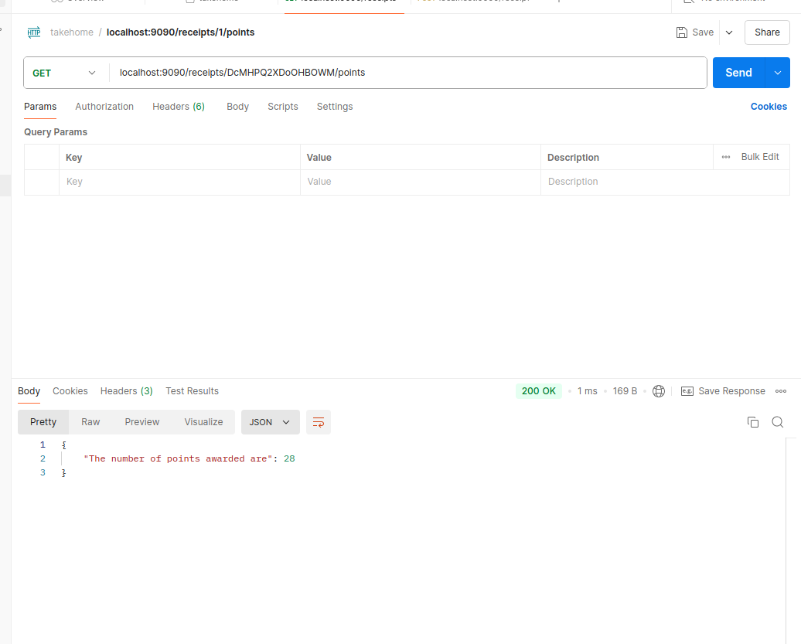
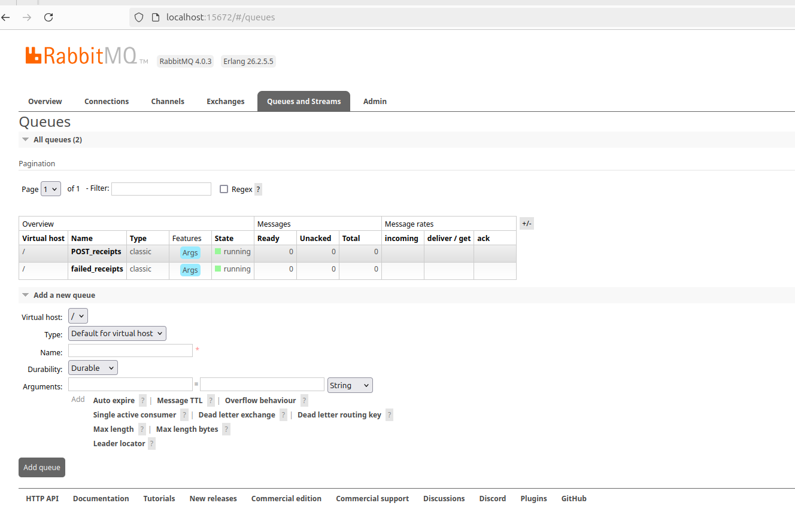
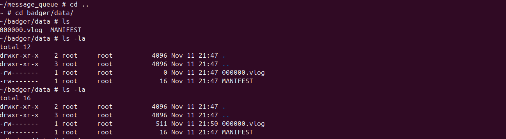

# Fetch Backend Engineer Assignment

This assignment is in two parts. Part 1 is the requirements as mentioned in the [assignment link](https://github.com/Anas-7/Fetch-Backend-Engineer-Assignment). Part 2 is implementation of concepts that I felt were relevant to job details and can possibly be included here, i.e., message queues and persistent storage. 

To clarify early on, I have ensured that no database download will be required from the engineers who review it.

There are two ways to run the assignment in part1.

## Part1

Extra libraries: [gin](https://github.com/gin-gonic/gin)

### How to Run

There are two options after cloning the repository. First option is:

`cd basic_implementation`

`go mod download`

`go run .`

Other option is to run through Docker:

`cd basic_implementation`

`docker build -t restapi .`

`docker run -p 9090:9090 restapi`

Use **Postman** with URL `localhost:9090` to access the GET and POST endpoints. An example from assignment with output is attached below:




We can copy the Id obtained and use it in GET request



This implementation contains the following checks:
1. GET requests only return points if ID exists and data integrity is checked
2. POST requests are checked for missing or extra fields
3. POST requests are checked to ensure the values have string types
4. POST requests are checked to ensure `purchaseDate` and `purchaseTime` have valid formats
5. POST requests are checked to ensure fields of `total` and `price` of items can be parsed as float


### Implementation Details

There are 3 relevant files:
1. `main.go`
2. `getUtils.go`
3. `postUtils.go`

#### main.go

It declares the types of the objects we are using, i.e., Item and Receipt, and creates a map called `receipts` that stores a string ID to Receipt mapping

```
type Item struct {
	ShortDescription string `json:"shortDescription"`
	Price            string `json:"price"`
}

type Receipt struct {
	Id           string `json:"Id"`
	Retailer     string `json:"retailer"`
	PurchaseDate string `json:"purchaseDate"`
	PurchaseTime string `json:"purchaseTime"`
	Items        []Item `json:"items"`
	Total        string `json:"total"`
}

var receipts = map[string]Receipt{}
```

This uses the `gin` library to create the router, assign routes to functions, and start the router on localhost with port 9090

There are two routes, GET and POST, and the functions associated with them are `getPoints` and `addReceipt` respectively

`getPoints` checks if the receipt exists inside the map and returns an error if its not found. If it is found, then it uses the `calculatePoints` function to obtain the points and returns an error if any data field was corrupted, or else returns the total points for a particular receipt.

`addReceipt` generates a 16 character ID using `generateID` followed by decoding the received JSON. It disallows unknown fields and performs validation to ensure that data format is strictly correct.

#### getUtils.go

The important function here is `calculatePoints` that takes a Receipt object and calls following functions to return an integer: 
1. `calculateRetailerNamePoints`: Uses `unicode` library to check count alphanumeric chars using `IsLetter()` and `IsNumber()`
2. `calculateTotalPricePoints`: Throws an error if string cannot be parsed as float. Otherwise, it performs the round number and divisible by 0.25 checks
3. `calculateItemCountPoints`: Returns the number of complete pairs of items multiplied by 5
4. `calculateItemDescriptionPoints`: Trims short description of each item and calculates points based on its price if length of trimmed string is a multiple of 3
5. `calculatePurchaseDatePoints`: Validates the day number and returns points if it was odd
6. `calculatePurchaseTimePoints`: Validates the hour and returns points if it is greater than or equal to 14 and less than 16


#### postUtils.go

The important function here is `validateReceiptFields` that takes a Receipt object and returns a boolean. It relies on the following:
1. Checks for empty fields and length of items being greater than 0
2. Uses `reflect` to check the type of fields are string
3. `isValidDate`: Validates the purchase date using `time.Parse` if it uses the `2022-01-01` or `2022-1-1` format
4. `isValidTime`: Validates the purchase time using `time.Parse` if it uses the `03:05` or `3:4` format
5. `isValidNumber`: Validates that the total and price of each item can be parsed to float using `strconv.ParseFloat`
6. Loops through each item to ensure its short description isn't an empty and it is a string

### Control Flow

#### GET Requests
1. Server routes request to `getPoints`
2. Extract the ID and check if it exists in `receipts` map. If not, throw an error that id was not found
3. If found, access the corresponding receipt and send it to `calculatePoints` to get points or an error. If we get an error, let the user know that data is corrupted
4. If no error, then display the points to the user for the receipt

#### POST requests
1. Server routes request to `addReceipt`
2. Extract the JSON and use `json.decoder` to decode it while checking for unknown fields. If found, then display an error that invalid receipt was sent
3. If no error, then convert it to Receipt object and validate it using `validateReceiptFields`. If it gives an error then inform the user and ask them to verify the fields and the value types
4. If no error is found, return the id of the generated receipt and store the receipt in the map

## Part2

The motivation for this was the idea that if the service is used extensively and we want to control the write speed to a database used by multiple sources, then a message queue can hold the verified POST requests for us. The consumer application can then fetch the messages at its own pace and write it to the database. Further, in case the database goes down we can push the message to a dead letter queue to avoid losing information and simulate sending a critical alert to monitoring systems and their admins.

Another reason was that when the server starts up, it should have information about exisiting receipts and that can be done via persistent storage. Thus, I use BadgerDB to achieve that in a manner where my server accesses data in a strict read-only manner and my consumer has write-privileges. Implementing a database that supported concurrent read-writes would be taking it more out of scope than I might already have.

### How to run it?

Clone the repository and type the following commands:

`cd advanced_implementation`

`docker-compose build --no-cache`

`docker-compose up`

Extra libraries: [amqp](https://github.com/streadway/amqp), [badgerDB](https://github.com/dgraph-io/badger)

Message Queue: RabbitMQ (Used via Docker)

The API calls are still made through `localhost:9090` just like before.

This will launch the RabbitMQ server first and can take some time. It exposes port `5672` for the `server` and `consumer` to connect, and port `15672` for us to be able to access the server using `locahost:15672` with username and password as `guest`. I have attached a screenshot of the same



I have written a health check to ensure that the server and consumer launch only after RabbitMQ is launched as they need to connect to it using `amqp.Dial`

It will be helpful to describe the implementation in a broad manner first.

### Control Flow and Implementation Overview

#### RabbitMQ
1. There are two queues created, one for handling POST requests data called `POST_receipts` and a dead letter queue called `failed_receipts`
2. Server only connects to `POST_receipts` queue, whereas the consumer connects to both

#### Server
1. Connects to RabbitMQ when it starts up otherwise it sends an alert (just a print statement)
2. Accesses/creates a `POST_receipts` queue and creates a channel to be able to publish messages to it
3. Accesses the DB to obtain data about existing receipts and populate the `receipts` map. DB.View ensures it is strictly read-only
4. When a POST request is validated the JSON is marshalled and sent to the `POST_receipts` queue if there is no error
5. If there is an error, then it means our consumer won't get messages and we send an alert. To prioritize not losing data over response speed I chose to write it in badgerDB. Ideally, there should have been locks implemented to avoid concurrency issues. Another solution could be to write the data locally, and then upload it to message queue once its back up.
6. Add the validated receipt to the receipts map to ensure the GET requests work

#### Consumer
1. Connects to RabbitMQ when it starts up otherwise it sends an alert (just a print statement).
2. Accesses/creates `POST_receipts` and `failed_receipts` queues
3. Utilizes `fetchMsg` channel to prevent the program exiting and keep processing the messages as they are made to `POST_receipts` from server
4. Uses transaction to commit the receipt data to the database if there is no error
5. If there is an error, then it pushes the message to dead letter queue `failed_receipts` and sends an alert. It also sends an alert if pushing to dead letter queue fails


### Verification

If you receive the following error when running `docker-compose up` then please try `docker rm -v -f rabbitmq server message_queue` before running it again
```
Starting rabbitmq ... done
Recreating server ... 
Recreating message_queue ... 

ERROR: for server  'ContainerConfig'

ERROR: for message_queue  'ContainerConfig'

ERROR: for server  'ContainerConfig'

ERROR: for message_queue  'ContainerConfig'
```

There are two claims I need to verify:
1. Claim 1: POST request data is published to message queue, gets accessed by consumer, and writes it to database
2. Claim 2: Data is persistent and server loads the existing receipts after restart

For the first claim, start the containers using `docker-compose up` and then open a new terminal to run: `docker exec -it message_queue sh`

If we do `ls` inside we will see the executable that is already launched. Type the following:

`cd ..`

`cd badger/data`

`ls -la`

Note the **time and ID** that it displays for the file `0000.vlog` or something similar. Wait a minute and then send a POST request via Postman, and after running `ls -la` it can be observed that the time gets updated. This verifies claim 1 because the write to database is last part of the pipeline




For claim 2, shut down the docker instance. When we re-launch it we should be able to make a GET call to the server with our ID and obtain the points for it. This verifies that the data is persistent and loads exiting receipts. Further, you can also check the logs of docker instance for "Successfully retrieved receipts from the database" and observe the previous receipts.


